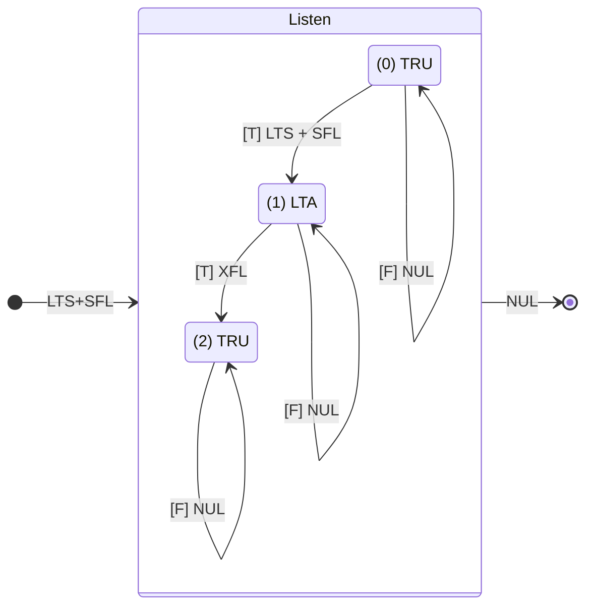
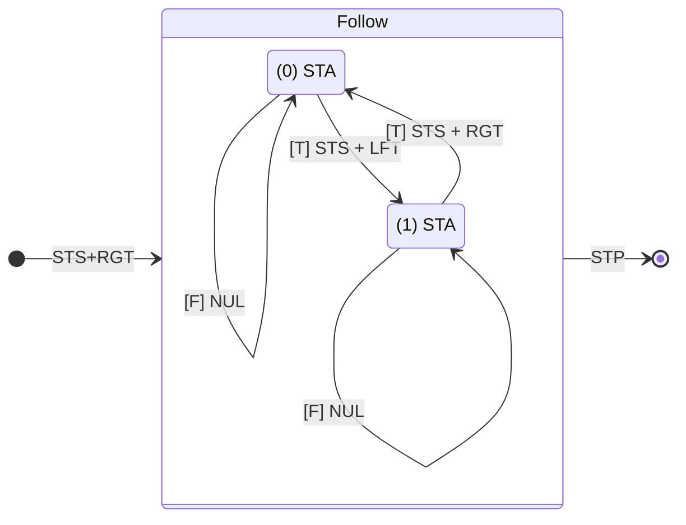

# Line Racer Sketch
This is a demo script for running the Line Racer robot.  It remains a work in progress, so it will change over time.

Currently, the Line Racer sketch uses the SateEngine class to define a couple of independent state machines which are capable of performing a set of predefined binary actions in response to a common set of binary events.

We'll begin be defining both the events that the robot can detect and the actions that it can take in response to the events.

### Events
The Line Racer robot is currently programmed to respond to the following binary events.  Each of these events have been given a three letter designator that will make it easier to refer to them in the state machine diagrams and the resulting code.
- Always True (TRU) - This event is always true and is used to automatically advance the robot from one state to the next.
- Short Timer Alarm (STA) - This event will become true when the short timer counts down to zero.
- Long Timer Alarm (LTA) - This event will become true when the long timer counts down to zero.

### Actions
The Line Racer robot will be able to perform any of the following binary actions in response to a detected event. As with the events, each action has been given a three letter designator to make it easier to reference in the state machine diagrms and the code itself.
- Do Nothing (NUL) - The robot will not take any actions during the transition between states.
- Short Timer Set (STS) - The short timer will be set to countdown for 500 milliseconds.
- Long Timer Set (LTS) - The long timer will be set to countdown for 4000 milliseconds.
- Turn Left (LFT) - The robot will start turning to the left.
- Turn Right (RGT) - The robot will start turning to the right.
- Stop (STP) - The robot will stop moving.
- Start Follow State Machine (SFL) - Starts the Follow State Machine.
- Stop Follow State Machine (XFL) - Stops the Follow State Machine.

### State Machine Diagrams
This sketch uses two state machine to control the robot's action.  

#### The Listen State Machine
The Listen state machine encodes a simple timer that controls when the Follow state machine starts and stops.  At a later point, I'll modify this SM so that it responds to audio ques from an onboard mic.

#### The Follow State Machine
The Follow state machine will eventually use a pair of pair of IR sensors to help the robot follow a black line.  Right now, it simply uses the short timer set (STS) action and short timer alarm (STA) event to alternates between running the left and right servo motors until it is shut down by the Listen SM.

[The Line Racer sketch](LineRacer.ino) shows how these state machines are implemented in Arduino code. The sketch relies on the following classes to manage the state machines, timers, sensors, and servos:
- [StateEngine Class](StateEngine.md)
- [Timer Class](Timer.md)
- [Sensor Class](Sensor.md)
- [Drive Class](Drive.md)
