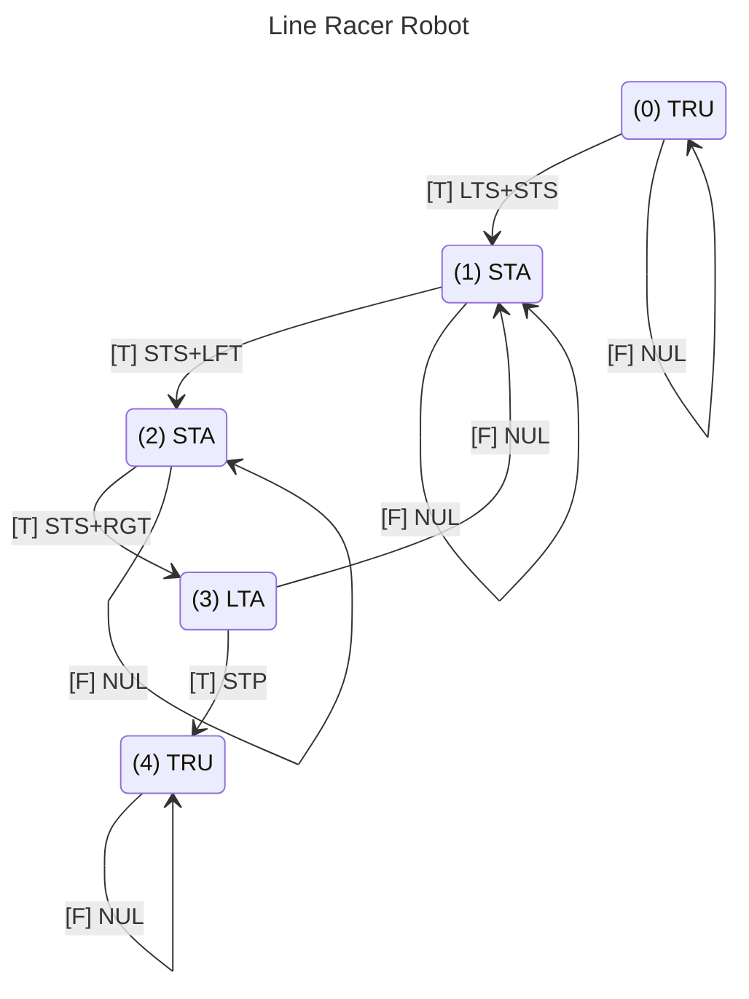

# Line Racer Code
This is a demo script for running the Line Racer robot.  It is a work in progress, so it will change over time.

The LineRacer.ino sketch currently uses the following classes witch are descibed below: 
- StateEngine Class
- Timer Class
- Sensor Class
- Drive Class

## Line Racer Sketch
The Line Racer sketch uses a number of state machines, which are constructed and maintained via the StateEngine Class to create a robot which is capable of following a line to it's end by using timers and sensors to guide its actions.

The following sketch provides an example of how you can code the [[Line Racer]].  I'm currently developing the code so this page will be changing over time.  Right now, I'm focused on getting the drive running in conjunction with the sensors.

### State Machine Actions
The state machine will be capable of performing the following actions:
- Do Nothing (NUL) - The robot will not take any actions during the transition between states.
- Short Timer Set (STS) - The short timer will be set to countdown for 500 milliseconds.
- Long Timer Set (LTS) - The long timer will be set to countdown for 4000 milliseconds.
- Turn Left (LFT) - The robot will start turning to the left.
- Turn Right (RGT) - The robot will start turning to the right.
- Stop (STP) - The robot will stop moving.
### State Machine Events
The robot will be triggered to move between states based on the following binary events:
- Always True (TRU) - This event is always true and is used to automatically advance the robot from one state to the next.
- Short Timer Alarm (STA) - This event will become true when the short timer counts down to zero.
- Long Timer Alarm (LTA) - This event will become true when the long timer counts down to zero.
- Left IR Sensor (LIR) - This event will be false when the left IR sensor detects a black line on the table.
- Right IR Sensor (RIR) - This event will register as false when the right IR sensor detects a black line.
### State Machine Diagrams

This sketch uses both Regulation and Navigation state machines.  The Regulation state machine encodes a simple timer that controls when the Navigation state machine starts and stops.

## StateEngine Class

## Timer Class

## Sensor Class

## Drive Class
