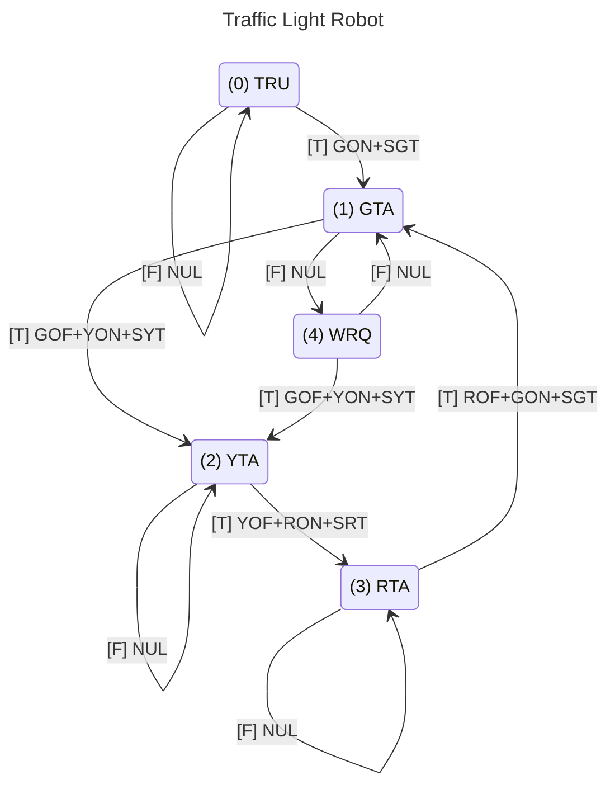

## Overview
This C++ class creates a simple state machine in which each state has a single Boolean trigger event that determines how it will transition out of the state and into another.  

Depending on whether the event is true or false, the machine will perform some actions and pass control to another state.

Although the rules for this state machine are quite simple, states can be linked via different user-defined triggers and actions to encode complex sets of environment-driven actions.

## Traffic Light Example
Here's an example of how you would use this class to program a traffic light robot.  The traffic light will cycle through green, yellow, and red lights and can be triggered to progress immediately to yellow and red if a pedestrian hits the walk request button.

The first thing I need to do is identify the set of actions this robot needs to take and the events that will trigger it to take different actions.  
### Actions
Basically, the robot must be able to set timers for each of its lights and turn them on and off when needed. These actions are as follow. I'm giving each action a three letter abbreviation to make it easier to reference them in the state diagram and resulting code.

* Do Nothing (NUL)
* Set Green Timer (SGT)
* Set Yellow Timer (SYT)
* Set Red Timer (SRT)
* Turn Green Light On (GON)
* Turn Green Light Off (GOF)
* Turn Yellow Light On (YON)
* Turn Yellow Light Off (YOF)
* Turn Red Light On (RON)
* Turn Red Light Off (ROF)

### Events
We also need to identify the five Boolean events that will trigger the robot to transition between states:

* Green Timer Alarm (GTA)
* Yellow Timer Alarm (YTA)
* Red Timer Alarm (RTA)
* Walk Request (WRQ)
* Always True (TRU)

The timer alarms (GTA, YTA, and RTA) will be false when their respective timers are counting down and pop true when the time is up.

The Walk Request event (WRQ) is true whenever someone is pressing the walk button and when the button is not pressed.

The Always True event (TRU) is used to force a transition from one state to the next.
### State Machine Diagram
Having identified the actions that the robot is capable of performing and the events that will cause it to move from one state to the next, we need to tie everything together in a state diagram. This diagram will consist of numbered states, with the robot starting at state zero.

Each state will have one Boolean event, which the robot monitors while sitting in that state, and two arrows coming out of it that direct the program's flow to another state depending on whether the monitored event is true or false.

Each arrow will have one or more actions associated with it.  The robot will perform these actions whenever it follows the arrow from one state to the next.

Here's the state diagram for our traffic light robot:



### Programming the example state machine
Once you've diagrammed the state machine, it's easy to convert it to code using the StateMachine class.

In order to demonstrate this process, I've implemented the traffic light state machine in an Arduino program, which takes advantaged of the StateMachine Class, [[Timer Class]], and [[Sensor Class]].  

You can find an example of this code in action on [Wokwi](https://wokwi.com/projects/378374185611933697).

## Coding the State Machin Class
You can use the following helper and ino files to implement define the StateMachine class that I used in the proceeding example.
### StateMachine.h
```C++
#pragma once

#define MAX_STATES 20

class StateMachine
{
  private:
    bool isActive = false;

    int triggers[MAX_STATES];
    int trueActions[MAX_STATES];
    int falseActions[MAX_STATES];
    int trueDestinations[MAX_STATES];
    int falseDestinations[MAX_STATES];

  	int currentState;
    int currentEvents;
  	int currentActions;

    int eventCount;
    int actionCount;
  
  public:
  	StateMachine();
    void addState(int _state, int _trigger, int _trueDestination, int _trueActions, int _falseDestination,  int _falseActions);
    int createEventHandle();
    int createActionHandle(); 
    void logEvent(int _event, bool _status);
    void evaluate();
    void start();
    void stop();
    void resume();
    int getState();
    bool requests(int _action);
};
```

### StateMachine.ino
```C++
#include "StateMachine.h"

StateMachine::StateMachine() {}

void StateMachine::addState(int _state, int _trigger, int _trueDestination, int _trueActions, int _falseDestination, int _falseActions)
{
  triggers[_state] = _trigger;
  trueActions[_state] = _trueActions;
  falseActions[_state] = _falseActions;
  trueDestinations[_state] = _trueDestination;
  falseDestinations[_state] = _falseDestination;
}

int StateMachine::createEventHandle()
{
  eventCount ++;
  return bit(eventCount - 1);
}

int StateMachine::createActionHandle()
{
  actionCount ++;
  return bit(actionCount - 1);
}

void StateMachine::logEvent(int _event, bool _status)
{
  if (_status) currentEvents = currentEvents | _event;
}

void StateMachine::evaluate()
{
  if ((triggers[currentState] & currentEvents) > 0)
  {
    currentActions = trueActions[currentState];
    currentState = trueDestinations[currentState];
  }
  else
  {
    currentActions = falseActions[currentState];
    currentState = falseDestinations[currentState];
  }
  currentEvents = 0;
}

void StateMachine::start()
{
  currentState = 0;
  isActive = true;
}

void StateMachine::stop()
{
  isActive = false;
}

void StateMachine::resume()
{
  isActive = true;
}

int StateMachine::getState()
{
  return currentState;
}

bool StateMachine::requests(int _action)
{
  return (currentActions & _action) > 0;
}
```


## Example
You can find a functional version of the class on [Wokwi](https://wokwi.com/projects/378374185611933697).
