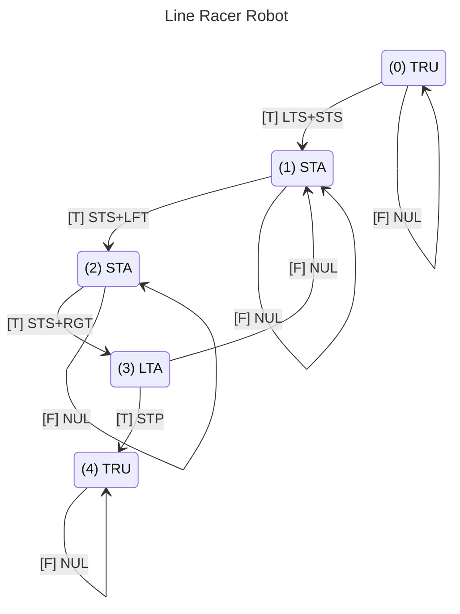

The following sketch provides an example of how you can code the Line Racer.  I'm currently developing the code so this page will be changing over time.  Right now, I'm focused on getting the drive running in conjunction with the sensors.

## State Machine Actions
The state machine will be capable of performing the following actions:
- Do Nothing (NUL) - The robot will not take any actions during the transition between states.
- Short Timer Set (STS) - The short timer will be set to countdown for 500 milliseconds.
- Long Timer Set (LTS) - The long timer will be set to countdown for 4000 milliseconds.
- Turn Left (LFT) - The robot will start turning to the left.
- Turn Right (RGT) - The robot will start turning to the right.
- Stop (STP) - The robot will stop moving.
## State Machine Events
The robot will be triggered to move between states based on the following binary events:
- Always True (TRU) - This event is always true and is used to automatically advance the robot from one state to the next.
- Short Timer Alarm (STA) - This event will become true when the short timer counts down to zero.
- Long Timer Alarm (LTA) - This event will become true when the long timer counts down to zero.
- Left IR Sensor (LIR) - This event will be false when the left IR sensor detects a black line on the table.
- Right IR Sensor (RIR) - This event will register as false when the right IR sensor detects a black line.
## State Machine Diagrams

This sketch uses both Regulation and Navigation state machines.  The Regulation state machine encodes a simple timer that controls when the Navigation state machine starts and stops.


## External Classes
This program uses the following Classes which are addressed separately on this site:
- StateMachine Class
- Timer Class
- Sensor Class
- Drive Class

## sketch.ino
```C++
#include "StateMachine.h"
#include "Timer.h"
#include "Sensor.h"
#include "Drive.h"

// Connections
#define LEFT_SERVO_PIN 10
#define RIGHT_SERVO_PIN 9
#define LEFT_IR_PIN A0
#define RIGHT_IR_PIN A1

// Parameters
#define IR_SAMPLE_PERIOD 10
#define IR_SAMPLE_THRESHOLD 10

// Create objects 
StateMachine sm;
Timer shortTimer(500);
Timer longTimer(4000);
Sensor leftIR(LEFT_IR_PIN, IR_SAMPLE_PERIOD, IR_SAMPLE_THRESHOLD);
Sensor rightIR(RIGHT_IR_PIN, IR_SAMPLE_PERIOD, IR_SAMPLE_THRESHOLD);
Drive myDrive;

// Create action handles
const int NUL = sm.createActionHandle(); // Do nothing
const int PST = sm.createActionHandle(); // Print current state
const int STS = sm.createActionHandle(); // Set short timer
const int LTS = sm.createActionHandle(); // Set long timer
const int LFT = sm.createActionHandle(); // Turn left
const int RGT = sm.createActionHandle(); // Turn right
const int STP = sm.createActionHandle(); // Stop motors

// Create event handles
const int TRU = sm.createEventHandle(); // Always true event
const int STA = sm.createEventHandle(); // Short timer alarm
const int LTA = sm.createEventHandle(); // Long timer alarm
const int LIR = sm.createEventHandle(); // Left IR sensor
const int RIR = sm.createEventHandle(); // Right IR sensor

void setup() {
  Serial.begin(9600);

  myDrive.attach(LEFT_SERVO_PIN, RIGHT_SERVO_PIN);
   
  // Construct state machine
  sm.addState(0, TRU, 1, LTS + STS + PST, 0, NUL);
  sm.addState(1, STA, 2, STS + PST + LFT, 1, NUL);
  sm.addState(2, STA, 3, STS + PST + RGT, 2, NUL);
  sm.addState(3, LTA, 4, STP, 1, NUL);
  sm.addState(4, TRU, 4, NUL, 4, NUL);
}

void loop() {
  // Log events
  sm.logEvent(TRU, true);
  sm.logEvent(STA, shortTimer.isAlarming());
  sm.logEvent(LTA, longTimer.isAlarming());
  sm.logEvent(LIR, ! leftIR.alarm());
  sm.logEvent(RIR, ! rightIR.alarm());
  
  // Evaluate state machine
  sm.evaluate();
  
  // Perform requested actions
  if(sm.requests(PST))
  {
    Serial.print("New state: ");
    Serial.println(sm.getState());
  }
  if(sm.requests(STS)) shortTimer.reset();
  if(sm.requests(LTS)) longTimer.reset();
  if(sm.requests(LFT)) myDrive.left(0.1);
  if(sm.requests(RGT)) myDrive.right(0.1);
  if(sm.requests(STP)) myDrive.stop();
}
```
