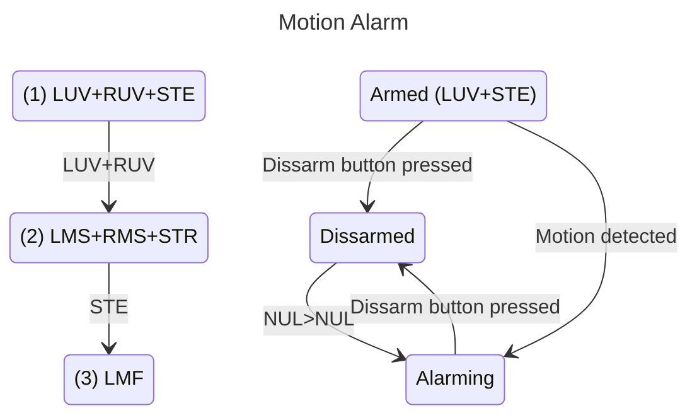

Finite State Machines are helpful tools to use when designing, outlining, and writing code for challenge bots.

State machines can be diagrammed with pencil and paper or by using any number of computer graphic appications.

[Mermaid](https://mermaid.js.org/) is  free online tool that helps users generate state machines and other diagrams from simple text-based instructions.

For example, when you give Mermaid the following script:
```
---
title: Motion Alarm
---
stateDiagram-v2
Dissarmed-->Armed:LUV : LMF+RMF
Armed-->Dissarmed:Dissarm button pressed
Armed-->Alarming:Motion detected
Alarming-->Dissarmed:Dissarm button pressed
```

It automatically generates a state diagram link this:


Visit the [Mermaid website](https://mermaid.js.org/) to learn more about the application and use its [Live Editor](https://mermaid.live/edit#pako:eNplkbFuwzAMRH9FULfCBoKMGjq06dil6VZ1YCw6FiKLgUTbNYL8e2XLgANXE_F4uiPIm6zIoFQyMjAeLJwDtGW_116k9_38I8ryRRzZOpfRXM4wNbfog3rrz0p8YeTcy2Q1UeITuQv-X_ctQGwyncs1IsPKQYwHrIUnXr7Vk9_QWMaNpKUeW_QsavJcRh4dKsvgbLURnsC8gnnvZ-3k9lTvdkVFjkI2LmaHAe25YXUiZ4rIgS5YDtZwo_bX3wWoEZ2jYZr2IWNZzUOM9rKQLYYWrElbv01iLblJ82qpUmkgXLTU_p500DEdR19JxaHDQnZXsx4pw_sf7haVrQ) to design and render your own [[Finite State Machines]].